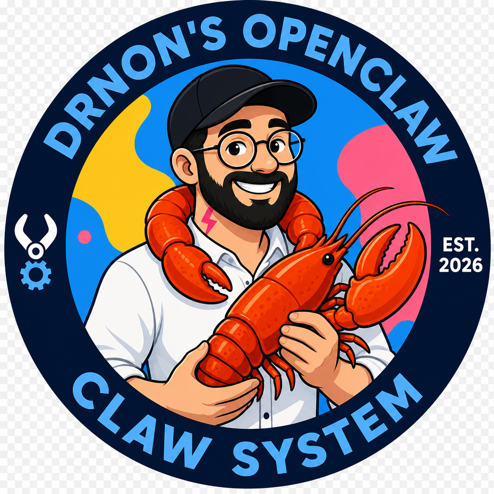
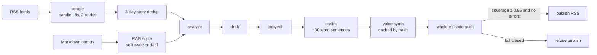

<p align="center">
  
</p>

# Non-Cast

**Fork this kit. Drop in your writing. Get a daily podcast.**

Non-Cast is generic. The forker supplies identity: a markdown corpus, a show name in `noncast.toml`, and (optional) a consented voice clip. The badge above is **example** art from one forker — not the product's face. Do not ship a photoreal portrait of someone else.

Pipeline: **scrape → analyze → draft → copyedit → ear-lint → voice synth → whole-episode audit → publish (RSS)**. Spotify and Apple follow the feed. There is no Spotify Partner API in this repo.

Works with **Cursor, Claude Code, Codex, Gemini CLI, Aider, OpenCode, VS Code, and a human in a terminal.** Read `AGENTS.md`. The happy path uses the `noncast` CLI and a local LLM over HTTP (Ollama). No vendor SDK is required.

## 10-minute fork-and-run

```bash
git clone https://github.com/Nonarkara/Non-Cast.git
cd Non-Cast
python3 -m venv .venv
source .venv/bin/activate   # Windows: .venv\Scripts\activate
pip install -e ".[dev]"

noncast init
# optional: copy your essays into corpus/*.md
noncast ingest ./corpus
noncast today --no-publish
# script: data/runs/YYYY-MM-DD/script.md
```

That is the success path. You get a spoken script from the local corpus. Publishing is **off** until you pass the coverage gate.

Natural language (calls Ollama if it is up; otherwise a heuristic parser):

```bash
noncast "make a 12 minute episode about voice cloning law, don't publish"
```

## Architecture



See [docs/architecture.md](docs/architecture.md) for stage contracts, cache keys, and voice backends.

## CLI

```text
noncast init
noncast ingest ./corpus
noncast today
noncast today --no-publish
noncast today --publish          # still fail-closed if coverage < 0.95
noncast "make a 12 minute episode about voice cloning law, don't publish"
noncast audit episode.mp3 episode.md
noncast scrape | analyze | draft | copyedit | earlint | voice | publish
python -m noncast.pipeline earlint
```

Default: **`--no-publish`**. Coverage must be **≥ 0.95** and the auditor must be clean. System-voice fallback (`say`, espeak) is never used; missing TTS means skip synthesis and refuse to publish.

## Add your voice (the show's, not a stranger's)

1. Put your essays and notes in `corpus/*.md`. This is the RAG source of truth.
2. Edit `noncast.toml`: show name, host name, style, optional RSS feeds.
3. Put a **consented** 5–15s clip at `voices/reference.wav` (gitignored).
4. Set `voice.backend`:
   - `f5-tts-mlx` — local, Apple Silicon (`pip install f5-tts-mlx`)
   - `elevenlabs` / `openai` — HTTP stubs, keys in `.env` only
   - `none` — script only (default)
5. `noncast ingest ./corpus` then `noncast today --no-publish`. Read the script. Only then `--publish`.

Copy `.env.example` to `.env` if you opt into hosted LLM or TTS. **Never commit keys or `reference.wav`.**

## RAG

Markdown on disk. Default index: `data/rag.sqlite`.

- `sqlite-vec` if you `pip install 'noncast[vec]'`
- otherwise **tf-idf** (always available, no GPU)

The example corpus is four placeholder essays about listening, RSS, voice consent, and local-first tools. Replace them. Do not paste anyone's private writing into a public fork.

## Quality gates

| Gate | Rule |
| --- | --- |
| Ear-lint | ~30 words per sentence; `lexicon/killwords.txt` |
| Facts | No invented family, quotes, or statistics |
| Dedup | Same URL or near-identical title within 3 days is skipped |
| Cache | TTS chunks keyed by `hash(text + voice-id + settings)` |
| RSS | Parallel fetch, 8s timeout, 2 retries — no 240s stall |
| Publish | Coverage ≥ 0.95, no audit errors, no system-voice fallback |

## LLM

Natural-language commands and optional draft polish:

| Backend | How |
| --- | --- |
| Ollama (default) | `POST $OLLAMA_HOST/api/generate` |
| OpenAI | `OPENAI_API_KEY` — stdlib HTTP |
| Anthropic | `ANTHROPIC_API_KEY` — stdlib HTTP |

If the model is down, drafting falls back to extractive assembly from the corpus. The day still produces a script.

## Tests

```bash
pytest -q
```

No GPU tests. CI runs on CPython 3.11 and 3.12.

## License

MIT. See [CONTRIBUTING.md](CONTRIBUTING.md) and [SECURITY.md](SECURITY.md).
