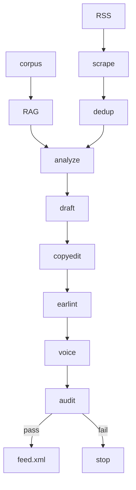

*Illustration: a mentor and a learner cutting a short spoken brief from writing already on the desk. One Mac, one microphone, rain on a Bangkok window. The drawing has no title card — the method is in this repo.*

# Non-Cast

**ชุดเครื่องมือพอดแคสต์ท้องถิ่น · A forkable kit for a daily (or on-demand) spoken brief.**

[](LICENSE)
[](pyproject.toml)
[](https://github.com/Nonarkara/Non-Cast/actions/workflows/ci.yml)

[How to use](#how-to-use--learn) · [System diagram](#system-diagram) · [AGENTS.md](AGENTS.md) · [Architecture](docs/architecture.md) · [Contributing](CONTRIBUTING.md)

By [Non Arkaraprasertkul](https://github.com/Nonarkara) (Nonarkara) — [Axiom X Co., Ltd.](https://axiom.nonarkara.org), Bangkok. Written for a **Thai–English** learner audience. This is independent studio software. It is **not** a Spotify Partner product, not a hosted SaaS, and not an official depa, ASEAN, or municipal publication.

---

## What this is

Non-Cast turns a **local markdown corpus** into a spoken script, optional audio, and — only if you ask and the auditor agrees — an RSS file on disk.

Identity is not in the engine. You supply it:

- essays and notes in `corpus/*.md`
- show name and host in `noncast.toml` (the checked-in default is a generic “Daily Brief”)
- an optional **consented** clip at `voices/reference.wav` (gitignored)

The pipeline is local and inspectable: **scrape → analyze → draft → copyedit → ear-lint → voice → audit → publish**. Spotify and Apple can follow a valid `public/feed.xml` the way any directory follows RSS. There is no partner API in this tree.

It is the production shape of a short daily briefing — the studio habit sometimes called a *World in Twenty Minutes* show: a length you can finish, assembled from writing you already own. The default in `noncast.toml` is **12 minutes**. Empty RSS feeds mean a corpus-only day and work offline.

Agents and humans share one CLI. Cursor, Claude Code, Codex, Gemini CLI, Aider, OpenCode, VS Code, and a person in a terminal all run `noncast` after reading `AGENTS.md`. The happy path needs **no vendor SDK**: Ollama over HTTP if you want a model, sqlite + tf-idf (or sqlite-vec) for retrieval.

**This repo is not:**

- A live show URL or a public episode archive. Runtime output lives under `data/runs/` and `public/`, both local.
- A black-box ranking product. Story ranking is a local step that writes `analysis.json` you can read.
- Permission to clone someone else’s voice or ship their private writing.

---

## Philosophy

Fork the **method**, not the secrets. The method is the pipeline, the fail-closed publish gate, the ear-lint, and the rule that a script may only say what the corpus or a fetched item already said. The secrets are API keys, `.env`, and `voices/reference.wav`. Those stay on your machine.

**One Mac.** The kit is meant to run on a single desk — ingest markdown, talk to a local model, write `script.md`. You do not need a GPU farm or a vendor lock-in to draft. Hosted LLM and TTS backends exist as optional HTTP stubs; they are opt-in, not the path.

**No black-box rankings.** Analyze may rank RSS items against the corpus. The score is not a product and not a city index. You can open the JSON. Publish is a **visible** gate: coverage must be at least `0.95`, the auditor must be clean, and a system voice (`say`, espeak) is never allowed to impersonate the host.

**Thai–English as the audience.** The studio writes for learners in Bangkok and elsewhere who read both languages. The engine’s default show language in `noncast.toml` is `en`; change it when you fork. Prose in this README is English with a Thai title line so a first glance is bilingual. Do not invent a Thai translation of a source that is only in English, or the reverse.

Code is communication with the next person at the desk — including an agent. If a rule looks odd (no system-TTS fallback, default `--no-publish`), the reason is in `AGENTS.md` and `docs/architecture.md`. Do not “clean it up.”

---

## Ethical use

This kit is for **your** writing and a **consented** voice. A clone that sounds like a throat is still not a right to that throat.

**Do**

- Speak only from `corpus/` and from items the scraper actually fetched. If a quote, a statistic, or a family story is not in those sources, it does not go in the script. Copyedit already strips unsourced quotes, numbers, and invented kinship.
- Keep `voices/reference.wav` off git, off screenshots, and out of issues. Treat it as a biometric-ish artifact.
- Leave publishing **off** until a human has read `script.md`. `noncast today` defaults to `--no-publish`. `--publish` still fail-closes on low coverage, audit errors, missing audio, or system-voice fallback.
- Put optional keys in `.env` only. Copy `.env.example`. Never commit `.env`.
- Label a computer voice as a computer voice. If synthesis is missing, skip voice and keep the script.

**Do not**

- Invent guests, sponsors, fines, bills, or “my mother…” color to make a sentence feel vivid.
- Use `say`, espeak, or any system TTS as a fallback host. The code refuses this on purpose.
- Commit API keys, tokens, or reference clips. If a contribution only works by pasting a secret, it does not belong here.
- Imply depa, ASEAN, a municipality, Spotify, Apple, or Axiom X publishes the forked show unless that show’s own feed and legal line say so.
- Ship a photoreal portrait of someone else as show art. Replace `docs/hero.png` with your own drawing if you fork the identity.

Law around voice cloning is local and unsettled. This README is a production rule, not legal advice.

---

## How to use / learn

```bash
git clone https://github.com/Nonarkara/Non-Cast.git
cd Non-Cast
python3 -m venv .venv
source .venv/bin/activate   # Windows: .venv\Scripts\activate
pip install -e ".[dev]"

noncast init
# optional: replace corpus/*.md with your essays
noncast ingest ./corpus
noncast today --no-publish
# script: data/runs/YYYY-MM-DD/script.md
```

That is the success path: a spoken script from the local corpus. Publishing stays off until coverage and the auditor pass.

Natural language (Ollama if it is up; otherwise a heuristic parser that still understands duration, topic, and “don’t publish”):

```bash
noncast "make a 12 minute episode about voice cloning law, don't publish"
```

### Make it your show

1. Put your essays in `corpus/*.md` and run `noncast ingest ./corpus`.
2. Edit `[show]` and `[persona]` in `noncast.toml`.
3. Add RSS URLs under `[rss].feeds` only if you want news beats. Empty feeds = corpus-only, offline.
4. For audio: a consented 5–15s clip at `voices/reference.wav`, then set `[voice].backend` to `f5-tts-mlx` (Apple Silicon), `elevenlabs`, or `openai`. Default is `none` (script only). Keys stay in `.env`.
5. Read `script.md`. Only then `noncast today --publish`.

### Commands

```text
noncast init
noncast ingest ./corpus
noncast today --no-publish
noncast today --publish          # still fail-closed if coverage < 0.95
noncast "make a 12 minute episode about <topic>, don't publish"
noncast audit episode.mp3 episode.md
noncast scrape | analyze | draft | copyedit | earlint | voice | publish
noncast status
python -m noncast.pipeline <stage>
pytest -q
```

Outputs for a date land in `data/runs/YYYY-MM-DD/` (`stories.json`, `analysis.json`, `script.md`, `earlint.json`, `voice.json`, `audit.json`, `summary.json`).

| Gate | What the tree actually does |
| --- | --- |
| Ear-lint | Split sentences over ~30 words; replacements in `lexicon/killwords.txt` |
| Facts | Copyedit drops unsourced quotes, stats, and invented family |
| Dedup | Same URL or near-identical title within 3 days is skipped (published runs only) |
| TTS cache | `hash(text + voice-id + settings)` under `data/cache/tts/` |
| RSS fetch | Parallel, 8s timeout, 2 retries |
| Publish | Coverage ≥ `pipeline.coverage_threshold` (0.95), no audit errors, no system voice |

LLM: default is local Ollama (`POST` to `llm.base_url`). Optional `OPENAI_API_KEY` / `ANTHROPIC_API_KEY` via stdlib HTTP. If the model is down, draft falls back to extractive assembly from the corpus. The day still produces a script.

Tests: `pytest -q`. CI runs CPython 3.11 and 3.12. No GPU tests. Tests do not hit live TTS APIs.

Learners: start with this README, then [docs/architecture.md](docs/architecture.md) for stage contracts. Agents: read [AGENTS.md](AGENTS.md) and do not invent a parallel toolchain.

---

## System diagram



RAG is `data/rag.sqlite`: sqlite-vec if you `pip install 'noncast[vec]'`, otherwise tf-idf. Voice backends: `none` (default), `f5-tts-mlx`, `elevenlabs`, `openai`. Publish writes RSS 2.0 + iTunes tags under `public/`. Stage I/O is in [docs/architecture.md](docs/architecture.md).

---

## License / contributing

[MIT](LICENSE). Copyright © 2026 **Non Arkaraprasertkul / Axiom X Co., Ltd.**

Reuse the kit with attribution. The grant covers **this repository**. It does not relicense your corpus, someone else’s voice, or upstream RSS items you fetch.

How to contribute is in [CONTRIBUTING.md](CONTRIBUTING.md). Do not weaken fail-closed publish, do not add system-TTS fallback, do not commit secrets or `reference.wav`, and do not invent family, quotes, or statistics in drafts or fixtures. Security reports: [SECURITY.md](SECURITY.md).

If you fork this into a show people actually hear, read the script before you publish.
