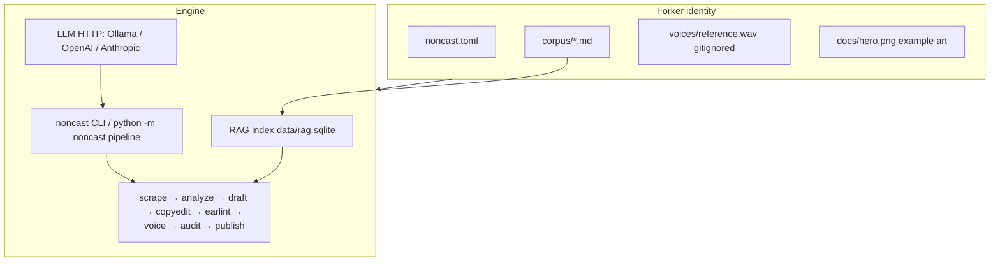
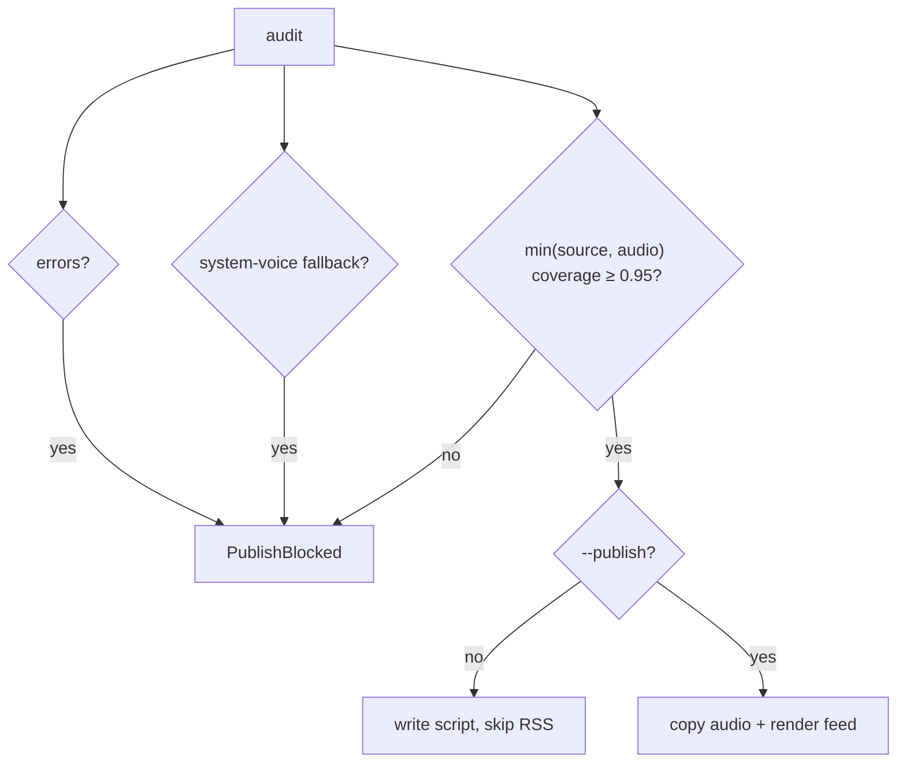

# Architecture

Non-Cast is a **local pipeline** plus a **CLI**. Forkers supply identity; the engine stays generic.

## Context



## Stage contracts

Each stage is runnable alone. Date stamp `YYYY-MM-DD`. Working directory: `data/runs/<date>/`.

| Stage | Reads | Writes | Notes |
| --- | --- | --- | --- |
| `scrape` | `[rss].feeds` | `stories.json` | Parallel HTTP, 8s timeout, 2 retries. `file://` allowed for tests. Empty feeds → corpus-only day. |
| `analyze` | `stories.json`, RAG | `analysis.json` | Rank stories vs corpus; retrieve `top_k` chunks for the topic. |
| `draft` | `analysis.json`, RAG, optional LLM | `script.md` | Extractive fallback if Ollama is down. `## Spoken` + `## Show notes`. |
| `copyedit` | `script.md`, corpus, lexicon | `script.md`, `copyedit.json` | Kill-words; drop unsourced quotes/stats/family. |
| `earlint` | `script.md`, lexicon | `script.md`, `earlint.json` | Split sentences over `max_sentence_words` (30). |
| `voice` | `script.md`, cache | `episode.wav`, `voice.json` | Backends: `none`, `f5-tts-mlx`, `elevenlabs`, `openai`. **No** `say`/espeak. |
| `audit` | script + audio + `voice.json` | `audit.json` | Fail-closed. Coverage = min(source, audio). |
| `publish` | audit + audio | `public/feed.xml`, `public/episodes/` | RSS 2.0 + iTunes tags. Spotify/Apple follow the feed. |

`noncast today` runs the chain. Default `publish=false`. `--publish` still calls `pipeline.publish.gate`.

## RAG

- Ingest: recursive `*.md`, chunk by words (`chunk_size` / `chunk_overlap`), skip unchanged file hashes.
- Retrieve: cosine tf-idf, or sqlite-vec hashed bags-of-words when `sqlite-vec` imports.
- No cloud embedding API on the happy path.

## Cache

```text
key = sha256(json({text, voice_id, settings}, sort_keys=True))
path = data/cache/tts/<key>.wav
```

A comma change is a miss, which is correct: the ear hears the comma.

## Dedup

`data/story-dedup.jsonl`. A story is old if, within `story_dedup_days` (3):

- URL matches, or
- title similarity ≥ 0.85

Only **published** runs record stories (so `--no-publish` rehearsal does not burn the window).

## Coverage and fail-closed publish



Source coverage: spoken sentences must overlap the corpus/show notes, except host glue (“Welcome to…”, “From the corpus…”).

Audio coverage: fraction of spoken sentences with `has_audio` in `voice.json`, else WAV duration / expected duration. If coverage cannot be determined, it is **0**.

## Voice backends

| id | Behavior |
| --- | --- |
| `none` | Skip synthesis. Default. |
| `f5-tts-mlx` | Local. Needs `voices/reference.wav` and the `f5-tts_mlx` CLI. **Apple Silicon.** Linux CI will skip, not fake a voice. |
| `elevenlabs` | HTTP stub. `ELEVENLABS_API_KEY`. |
| `openai` | HTTP stub. `OPENAI_API_KEY`. |
| `null` | Silent WAV. Test-only (`NONCAST_ALLOW_NULL_VOICE=1`). Not publishable as a host. |

## LLM

`noncast.llm.complete` — stdlib `urllib`. Timeouts from `llm.timeout_seconds` (30). NL path: `noncast.nl.parse_nl` tries the model, then the heuristic that understands:

`make a 12 minute episode about voice cloning law, don't publish`

## What is out of scope

- Spotify Partner API, Apple Partner API, YouTube upload
- Committing secrets or reference clips
- Photoreal generated faces as show art
